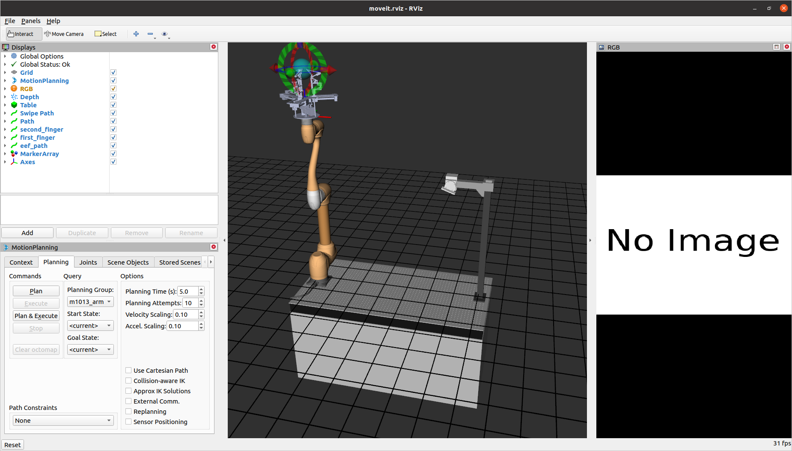
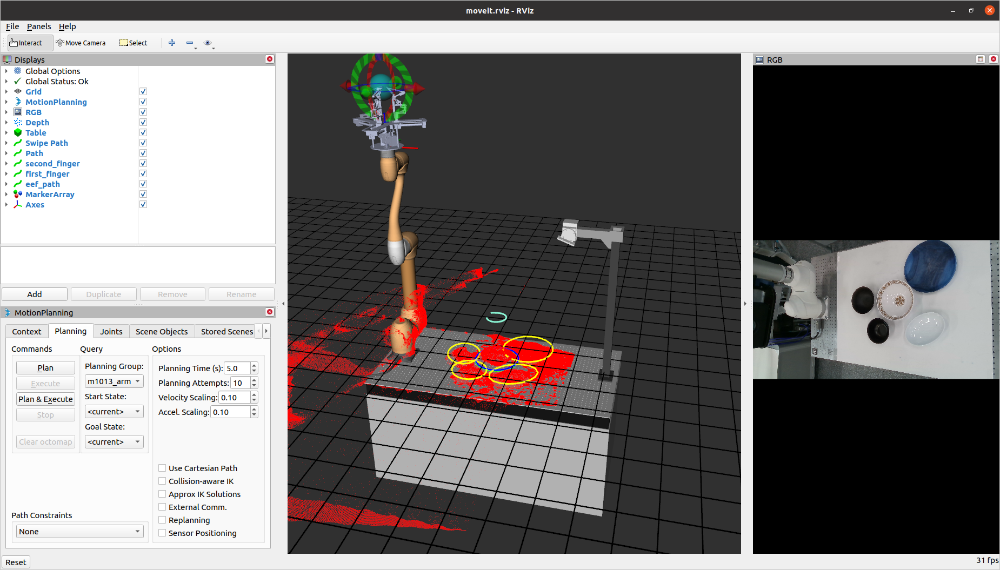
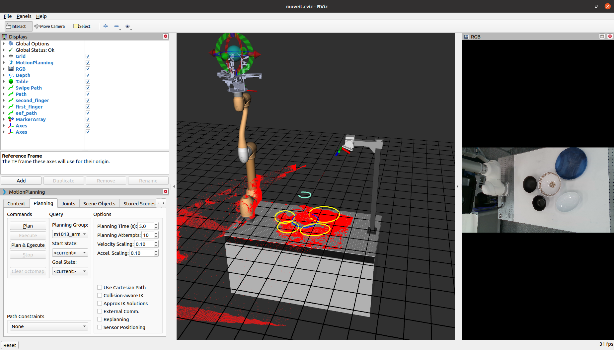
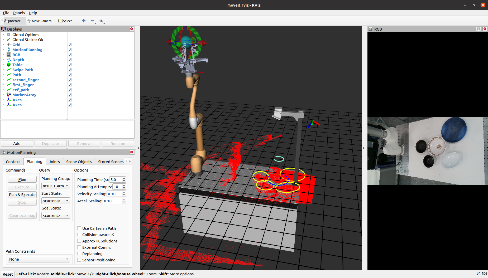
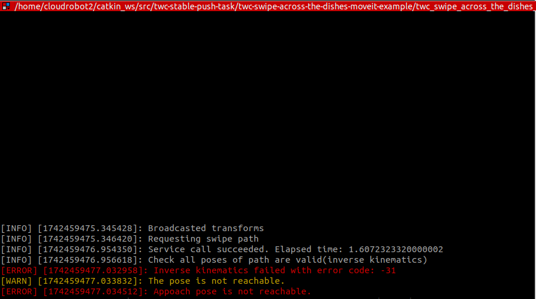

# twc-swipe-across-the-dishes-moveit-example
- This project provides MoveIt example to for [twc-swipe-across-the-dishes](https://github.com/HJS-HJS/twc_swipe_across_the_dishes) module.
- Use MoveIt to move m1013 doosan manipulator.
- Use MoveIt to check the path is valid.

<div align="center">
  <table>
    <tr>
      <td align="center">
        
        <br><b>MoveIt! example code</b>
      </td>
      <td align="center">
        
        <br><b>Generated swipe path with example</b>
      </td>
      <td align="center">
        
        <br><b>Move along the generated path</b>
      </td>
    </tr>
  </table>
</div>

# environment
- ROS Noetic
- MoveIt!

# install
- Doosan m1013 driver
    - [installation link](https://github.com/doosan-robotics/doosan-robot)
- twc-swipe-across-the-dishes module
    - [installation link](https://github.com/HJS-HJS/twc_swipe_across_the_dishes)
    - This code must be installed for example to work.

# Run example1 code
- The basic example of creating a push path
- launch MoveIt! example code
    - launch in virtual mode
        ```bash
        roslaunch twc_swipe_across_the_dishes_moveit_example real.launch mode:=virtual
        ```
    - if you connect to real robot
        ```bash
        roslaunch twc_swipe_across_the_dishes_moveit_example real.launch
        ```
- launch swipe server module
    ```bash
    roslaunch swipe_across_the_dishes server.launch
    ```
- launch swipe example code
    ```bash
    roslaunch twc_swipe_across_the_dishes_move_example example1.launch
    ```
- result
  <div align="center">
  <table>
    <tr>
      <td align="center">
        
        <br><b>Generated path from example1 code</b>
      </td>
    </tr>
  </table>
</div>

# Run example2 code
- Unfeasible swipe paths are verified through MoveIt!'s inverse kinematic calculations.
- Provide an offset of 0.5m depth in the x direction from the base link, with the same depth as Example 1.
- launch MoveIt! example code
    - launch in virtual mode
        ```bash
        roslaunch twc_swipe_across_the_dishes_moveit_example real.launch mode:=virtual
        ```
    - if you connect to real robot
        ```bash
        roslaunch twc_swipe_across_the_dishes_moveit_example real.launch
        ```
- launch swipe server module
    ```bash
    roslaunch swipe_across_the_dishes server.launch
    ```
- launch swipe example code
    ```bash
    roslaunch twc_swipe_across_the_dishes_move_example example2.launch
    ```
- result
  <div align="center">
  <table>
    <tr>
      <td align="center">
        
        <br><b>Generated path from example2 code</b>
      </td>
      <td align="center">
        
        <br><b>Invalid message from motion planner</b>
      </td>
    </tr>
  </table>
</div>